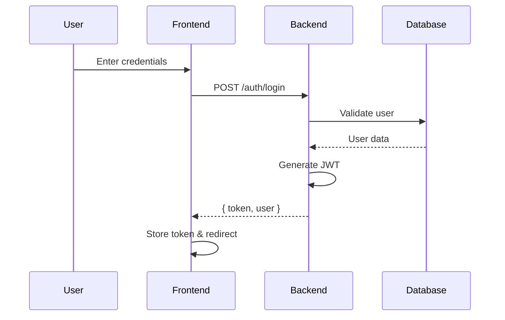
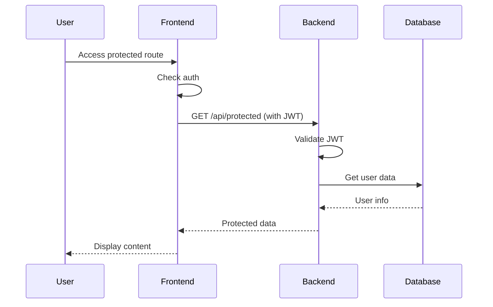

# 📋 TÀI LIỆU DỰ ÁN JOB PORTAL SYSTEM

**Tên dự án:** Job Portal System (JV)  
**Môn học:** Tốt Nghiệp  
**Công nghệ:** Spring Boot + Vue.js  
**Tác giả:** [Tên sinh viên]  
**Ngày tạo:** 28/02/2026  

## 🎯 GIỚI THIỆU TỔNG QUAN

### Mục tiêu dự án
Xây dựng một hệ thống cổng tuyển dụng việc làm toàn diện, kết nối giữa nhà tuyển dụng và ứng viên, cung cấp các công cụ quản lý việc làm, hồ sơ, ứng tuyển và phân tích thị trường lao động.

### Chức năng chính
- **Đăng ký/Đăng nhập** người dùng (Ứng viên, Nhà tuyển dụng, Admin)
- **Quản lý công việc** (CRUD, tìm kiếm, lọc)
- **Ứng tuyển công việc** và theo dõi tiến độ
- **Quản lý hồ sơ CV** (tạo, chỉnh sửa, upload)
- **Hệ thống thông báo** thời gian thực
- **Dashboard Analytics** cho từng vai trò
- **Blog & Cẩm nang** nghề nghiệp

---

## 🏗️ CÔNG NGHỆ SỬ DỤNG

### Backend (Spring Boot)
| Công nghệ | Phiên bản | Lý do chọn |
|-----------|-----------|------------|
| **Spring Boot** | 3.2.0 | Framework Java phổ biến, tích hợp nhiều tính năng sẵn có |
| **Java** | 21 | Ngôn ngữ mạnh mẽ, hiệu suất cao, hỗ trợ nhiều tính năng mới |
| **Spring Security + JWT** | Latest | Xác thực an toàn, không trạng thái, dễ tích hợp |
| **Spring Data JPA** | Latest | ORM mạnh mẽ, giảm boilerplate code |
| **MySQL** | 8.2.0 | Database phổ biến, hiệu suất tốt, dễ quản lý |
| **Flyway** | Latest | Quản lý database migration hiệu quả |
| **Spring Doc OpenAPI** | 2.3.0 | Tạo API documentation tự động |
| **Lombok** | 1.18.30 | Giảm code boilerplate, tăng tính đọc |
| **MapStruct** | 1.5.5.Final | Chuyển đổi object hiệu quả |
| **Google OAuth** | 2.2.0 | Đăng nhập social network |

### Phân tích chi tiết POM.XML

#### 1. Spring Boot Starters (Cốt lõi)
```xml
<!-- Spring Boot Starters -->
<dependency>
    <groupId>org.springframework.boot</groupId>
    <artifactId>spring-boot-starter-data-jpa</artifactId>
</dependency>
<dependency>
    <groupId>org.springframework.boot</groupId>
    <artifactId>spring-boot-starter-security</artifactId>
</dependency>
<dependency>
    <groupId>org.springframework.boot</groupId>
    <artifactId>spring-boot-starter-validation</artifactId>
</dependency>
<dependency>
    <groupId>org.springframework.boot</groupId>
    <artifactId>spring-boot-starter-mail</artifactId>
</dependency>
<dependency>
    <groupId>org.springframework.boot</groupId>
    <artifactId>spring-boot-starter-web</artifactId>
</dependency>
<dependency>
    <groupId>org.springframework.boot</groupId>
    <artifactId>spring-boot-starter-actuator</artifactId>
</dependency>
```

**Giải thích:**
- **spring-boot-starter-web**: Cung cấp Spring MVC, Tomcat, JSON support - nền tảng cho REST API
- **spring-boot-starter-data-jpa**: ORM layer, quản lý database với Hibernate
- **spring-boot-starter-security**: Authentication & Authorization framework
- **spring-boot-starter-validation**: Bean validation (JSR-303) cho input validation
- **spring-boot-starter-mail**: Gửi email (xác thực, quên mật khẩu)
- **spring-boot-starter-actuator**: Monitoring & health check cho production

#### 2. Database & Migration
```xml
<!-- Flyway - Database Migration -->
<dependency>
    <groupId>org.flywaydb</groupId>
    <artifactId>flyway-mysql</artifactId>
</dependency>

<!-- MySQL Database -->
<dependency>
    <groupId>com.mysql</groupId>
    <artifactId>mysql-connector-j</artifactId>
    <version>${mysql.version}</version>
</dependency>
```

**Giải thích:**
- **Flyway**: Quản lý database schema migration, đảm bảo consistency giữa các môi trường
- **MySQL Connector**: Driver kết nối tới MySQL database

#### 3. JWT Authentication
```xml
<!-- JWT -->
<dependency>
    <groupId>io.jsonwebtoken</groupId>
    <artifactId>jjwt-api</artifactId>
    <version>${jjwt.version}</version>
</dependency>
<dependency>
    <groupId>io.jsonwebtoken</groupId>
    <artifactId>jjwt-impl</artifactId>
    <version>${jjwt.version}</version>
    <scope>runtime</scope>
</dependency>
<dependency>
    <groupId>io.jsonwebtoken</groupId>
    <artifactId>jjwt-jackson</artifactId>
    <version>${jjwt.version}</version>
    <scope>runtime</scope>
</dependency>
```

**Giải thích:**
- **JJWT**: Thư viện tạo và verify JWT tokens
- **jjwt-api**: Interface và core classes
- **jjwt-impl**: Implementation classes
- **jjwt-jackson**: JSON processing support

#### 4. Development & Testing
```xml
<!-- Development Tools -->
<dependency>
    <groupId>org.springframework.boot</groupId>
    <artifactId>spring-boot-devtools</artifactId>
    <scope>runtime</scope>
    <optional>true</optional>
</dependency>

<!-- Lombok -->
<dependency>
    <groupId>org.projectlombok</groupId>
    <artifactId>lombok</artifactId>
    <version>${lombok.version}</version>
    <scope>provided</scope>
</dependency>

<!-- MapStruct -->
<dependency>
    <groupId>org.mapstruct</groupId>
    <artifactId>mapstruct</artifactId>
    <version>${mapstruct.version}</version>
</dependency>
```

**Giải thích:**
- **spring-boot-devtools**: Auto-restart, live reload trong development
- **Lombok**: Giảm boilerplate code với @Data, @Builder, @AllArgsConstructor, v.v.
- **MapStruct**: Object mapping tự động, hiệu quả hơn manual mapping

#### 5. API Documentation
```xml
<!-- Swagger/OpenAPI -->
<dependency>
    <groupId>org.springdoc</groupId>
    <artifactId>springdoc-openapi-starter-webmvc-ui</artifactId>
    <version>${springdoc.version}</version>
</dependency>
```

**Giải thích:**
- **SpringDoc OpenAPI**: Tạo API documentation tự động, thay thế Swagger
- Cung cấp UI tại `/swagger-ui/index.html`

#### 6. Utility Libraries
```xml
<!-- Apache Commons -->
<dependency>
    <groupId>org.apache.commons</groupId>
    <artifactId>commons-lang3</artifactId>
</dependency>

<!-- JSON Processing -->
<dependency>
    <groupId>com.fasterxml.jackson.core</groupId>
    <artifactId>jackson-databind</artifactId>
</dependency>
<dependency>
    <groupId>com.fasterxml.jackson.datatype</groupId>
    <artifactId>jackson-datatype-jsr310</artifactId>
</dependency>

<!-- File Upload -->
<dependency>
    <groupId>commons-io</groupId>
    <artifactId>commons-io</artifactId>
    <version>2.14.0</version>
</dependency>
```

**Giải thích:**
- **Apache Commons Lang3**: Utility classes (StringUtils, CollectionUtils)
- **Jackson**: JSON serialization/deserialization
- **commons-io**: File handling utilities

#### 7. Google OAuth (Optional)
```xml
<!-- Google OAuth (optional) -->
<dependency>
    <groupId>com.google.api-client</groupId>
    <artifactId>google-api-client</artifactId>
    <version>2.2.0</version>
</dependency>
<dependency>
    <groupId>com.google.auth</groupId>
    <artifactId>google-auth-library-oauth2-http</artifactId>
    <version>1.19.0</version>
</dependency>
```

**Giải thích:**
- **Google API Client**: Integration với Google APIs
- **Google Auth Library**: OAuth2 authentication

#### 8. Compiler Plugin Configuration
```xml
<plugin>
    <groupId>org.apache.maven.plugins</groupId>
    <artifactId>maven-compiler-plugin</artifactId>
    <configuration>
        <source>21</source>
        <target>21</target>
        <annotationProcessorPaths>
            <path>
                <groupId>org.projectlombok</groupId>
                <artifactId>lombok</artifactId>
                <version>${lombok.version}</version>
            </path>
            <path>
                <groupId>org.mapstruct</groupId>
                <artifactId>mapstruct-processor</artifactId>
                <version>${mapstruct.version}</version>
            </path>
            <!-- Lombok MapStruct binding -->
            <path>
                <groupId>org.projectlombok</groupId>
                <artifactId>lombok-mapstruct-binding</artifactId>
                <version>0.2.0</version>
            </path>
        </annotationProcessorPaths>
    </configuration>
</plugin>
```

**Giải thích:**
- **Annotation Processors**: Xử lý annotations tại compile-time
- **Lombok**: Generate getters, setters, constructors
- **MapStruct**: Generate mapping code
- **Lombok MapStruct binding**: Tối ưu hóa khi dùng cả hai

#### 9. Test Dependencies
```xml
<!-- Test Dependencies -->
<dependency>
    <groupId>org.springframework.boot</groupId>
    <artifactId>spring-boot-starter-test</artifactId>
    <scope>test</scope>
</dependency>
<dependency>
    <groupId>org.springframework.security</groupId>
    <artifactId>spring-security-test</artifactId>
    <scope>test</scope>
</dependency>
<dependency>
    <groupId>com.h2database</groupId>
    <artifactId>h2</artifactId>
    <scope>test</scope>
</dependency>
```

**Giải thích:**
- **spring-boot-starter-test**: Testing framework (JUnit, Mockito, AssertJ)
- **spring-security-test**: Testing security features
- **H2 Database**: In-memory database cho testing

### Frontend (Vue.js)
| Công nghệ | Phiên bản | Lý do chọn |
|-----------|-----------|------------|
| **Vue 3** | Latest | Framework frontend hiện đại, hiệu suất cao |
| **TypeScript** | 5.3.3 | Type safety, giảm lỗi, tăng khả năng bảo trì |
| **Element Plus** | 2.4.4 | UI components đẹp, responsive, dễ sử dụng |
| **TailwindCSS** | 3.3.6 | Styling linh hoạt, nhanh chóng |
| **Pinia** | 2.1.7 | State management hiện đại, thay thế Vuex |
| **Vue Router** | 4.2.5 | Routing SPA hiệu quả |
| **Axios** | 1.6.2 | HTTP client mạnh mẽ, dễ sử dụng |
| **Vite** | 5.0.10 | Build tool nhanh, HMR hiệu quả |

---

## 🗄️ CẤU TRÚC DATABASE

### ER Diagram (Entity Relationship)
```
Users (1) ←→ (1) JobSeekerProfiles
Users (1) ←→ (1) Companies
Users (1) ←→ (N) JobApplications
Companies (1) ←→ (N) Jobs
Jobs (1) ←→ (N) JobApplications
Jobs (1) ←→ (N) SavedJobs
Users (1) ←→ (N) Notifications
Users (1) ←→ (N) CVs
```

### Các bảng chính

#### 1. Users
```sql
CREATE TABLE Users (
    UserId INT PRIMARY KEY AUTO_INCREMENT,
    Email NVARCHAR(256) UNIQUE NOT NULL,
    PasswordHash NVARCHAR(512),
    DisplayName NVARCHAR(200),
    Role NVARCHAR(50) NOT NULL,
    IsEmailConfirmed BIT DEFAULT 0,
    IsActive BIT DEFAULT 1,
    CreatedAt DATETIME2 DEFAULT SYSUTCDATETIME()
);
```

#### 2. Companies
```sql
CREATE TABLE Companies (
    CompanyId INT PRIMARY KEY AUTO_INCREMENT,
    UserId INT UNIQUE,
    Name NVARCHAR(300) NOT NULL,
    Industry NVARCHAR(200),
    CompanySize NVARCHAR(50),
    Website NVARCHAR(500),
    Location NVARCHAR(300),
    Description NVARCHAR(MAX),
    IsVerified BIT DEFAULT 0,
    CreatedAt DATETIME2 DEFAULT SYSUTCDATETIME()
);
```

#### 3. Jobs
```sql
CREATE TABLE Jobs (
    JobId INT PRIMARY KEY AUTO_INCREMENT,
    CompanyId INT NOT NULL,
    Title NVARCHAR(300) NOT NULL,
    Description NVARCHAR(MAX),
    Requirements NVARCHAR(MAX),
    Benefits NVARCHAR(MAX),
    SalaryMin INT,
    SalaryMax INT,
    JobType NVARCHAR(50),
    Location NVARCHAR(300),
    Status NVARCHAR(50) DEFAULT 'Draft',
    PostedAt DATETIME2,
    CreatedAt DATETIME2 DEFAULT SYSUTCDATETIME()
);
```

#### 4. JobApplications
```sql
CREATE TABLE JobApplications (
    ApplicationId INT PRIMARY KEY AUTO_INCREMENT,
    JobId INT NOT NULL,
    JobSeekerProfileId INT NOT NULL,
    CVId INT,
    Status NVARCHAR(50) DEFAULT 'Applied',
    AppliedAt DATETIME2 DEFAULT SYSUTCDATETIME(),
    UNIQUE (JobId, JobSeekerProfileId)
);
```

### Enums quan trọng
- **UserRole**: JOB_SEEKER, EMPLOYER, ADMIN
- **ApplicationStatus**: PENDING, VIEWED, UNDER_REVIEW, INTERVIEW, OFFER, REJECTED, ACCEPTED
- **JobType**: FULL_TIME, PART_TIME, INTERNSHIP, REMOTE, CONTRACT
- **JobStatus**: DRAFT, ACTIVE, CLOSED, FILLED

---

## 🏗️ CẤU TRÚC BACKEND

### Module Architecture
```
backend/src/main/java/org/example/backend/
├── common/
│   ├── base/           # BaseEntity, BaseRepository, BaseService
│   ├── enums/          # UserRole, ApplicationStatus, JobType, v.v.
│   ├── exception/      # Custom exceptions (ResourceNotFoundException, v.v.)
│   ├── response/       # ApiResponse wrapper
│   └── security/       # JWT, SecurityConfig, UserDetails
├── module/
│   ├── auth/           # Authentication (Login, Register, JWT)
│   ├── user/           # User management
│   ├── company/        # Company profiles
│   ├── job/            # Job listings
│   ├── jobseeker/      # Job seeker profiles
│   ├── application/    # Job applications
│   ├── notification/   # Notification system
│   ├── savedjob/       # Saved/favorite jobs
│   ├── cv/             # CV management & upload
│   └── analytics/      # Dashboard analytics
└── BackendApplication.java
```

### Base Classes

#### BaseEntity.java
```java
@MappedSuperclass
@EntityListeners(AuditingEntityListener.class)
public abstract class BaseEntity {
    
    @Id
    @GeneratedValue(strategy = GenerationType.IDENTITY)
    protected Long id;
    
    @CreatedDate
    @Column(nullable = false, updatable = false)
    protected LocalDateTime createdAt;
    
    @LastModifiedDate
    @Column(nullable = false)
    protected LocalDateTime updatedAt;
    
    @Version
    protected Long version;
    
    // Getters and setters
}
```

#### BaseRepository.java
```java
@NoRepositoryBean
public interface BaseRepository<T extends BaseEntity> extends JpaRepository<T, Long> {
    // Common repository methods
}
```

#### BaseService.java
```java
public interface BaseService<T, ID> {
    T findById(ID id);
    List<T> findAll();
    T save(T entity);
    void deleteById(ID id);
}
```

---

## 🌐 CẤU TRÚC FRONTEND

### Component Architecture
```
frontend/src/
├── components/         # Reusable components
│   ├── Header.vue
│   ├── Footer.vue
│   └── Layout.vue
├── views/             # Page components
│   ├── Home.vue
│   ├── auth/
│   ├── admin/
│   ├── employer/
│   └── jobseeker/
├── modules/           # Feature modules
│   └── auth/
├── services/          # API services
│   └── api.js
├── store/             # State management
│   └── index.js
├── router/            # Route configuration
│   └── index.js
└── assets/            # Static assets
```

### State Management (Pinia)

#### Auth Store
```javascript
export const useAuthStore = defineStore('auth', () => {
    // State
    const user = ref(null)
    const token = ref(localStorage.getItem('token'))
    const isAuthenticated = computed(() => !!token.value)
    
    // Actions
    const login = async (credentials) => {
        const response = await api.post('/auth/login', credentials)
        if (response.data.success) {
            token.value = response.data.data.token
            user.value = response.data.data.user
            localStorage.setItem('token', token.value)
            localStorage.setItem('user', JSON.stringify(user.value))
        }
    }
    
    return { user, token, isAuthenticated, login }
})
```

### API Service
```javascript
import axios from 'axios'

const api = axios.create({
    baseURL: import.meta.env.VITE_API_URL,
    timeout: 10000
})

// Request interceptor for JWT
api.interceptors.request.use(
    (config) => {
        const token = localStorage.getItem('token')
        if (token) {
            config.headers.Authorization = `Bearer ${token}`
        }
        return config
    },
    (error) => Promise.reject(error)
)

// Response interceptor for auth errors
api.interceptors.response.use(
    (response) => response,
    (error) => {
        if (error.response?.status === 401) {
            localStorage.removeItem('token')
            localStorage.removeItem('user')
            window.location.href = '/login'
        }
        return Promise.reject(error)
    }
)
```

---

## 🔌 API INTEGRATION

### Authentication Flow

#### 1. Login Flow


#### 2. Protected Route Flow


### Role-Based Access Control

#### Route Guards
```javascript
router.beforeEach((to, from, next) => {
    const requiresAuth = to.meta.requiresAuth
    const requiresRole = to.meta.requiresRole
    const user = JSON.parse(localStorage.getItem('user') || 'null')
    
    if (requiresAuth) {
        if (!user) {
            next('/login')
        } else if (requiresRole) {
            // ADMIN có thể truy cập tất cả
            // EMPLOYER có thể truy cập employer và một số trang jobseeker
            // JOBSEEKER có thể truy cập jobseeker
            const userRole = user.role
            if (userRole === 'ADMIN') {
                next()
            } else if (userRole !== requiresRole) {
                next('/unauthorized')
            } else {
                next()
            }
        } else {
            next()
        }
    } else {
        next()
    }
})
```

### API Endpoints (47 APIs)

#### Authentication (7 APIs)
| Method | Endpoint | Description |
|--------|----------|-------------|
| POST | `/api/auth/register` | Register new user |
| POST | `/api/auth/login` | User login |
| POST | `/api/auth/forgot-password` | Request password reset |
| POST | `/api/auth/reset-password` | Reset password with OTP |
| POST | `/api/auth/change-password` | Change password |
| POST | `/api/auth/verify-email` | Verify email |
| POST | `/api/auth/logout` | Logout |

#### Jobs (5 APIs)
| Method | Endpoint | Description |
|--------|----------|-------------|
| POST | `/api/jobs` | Create new job |
| GET | `/api/jobs` | Get jobs with filters |
| GET | `/api/jobs/{id}` | Get job details |
| PUT | `/api/jobs/{id}` | Update job |
| DELETE | `/api/jobs/{id}` | Delete job |

#### Applications (8 APIs)
| Method | Endpoint | Description |
|--------|----------|-------------|
| POST | `/api/applications/apply` | Apply for job |
| GET | `/api/applications/my-applications` | Get user applications |
| GET | `/api/applications/{id}` | Get application details |
| PUT | `/api/applications/{id}/status` | Update application status |
| DELETE | `/api/applications/{id}/withdraw` | Withdraw application |
| GET | `/api/applications/job/{jobId}` | Get job applicants |
| GET | `/api/applications/job/{jobId}/status/{status}` | Filter by status |
| GET | `/api/applications/job/{jobId}/count` | Count applications |

---

## 🔐 SECURITY IMPLEMENTATION

### JWT Authentication

#### SecurityConfig.java
```java
@Configuration
@EnableWebSecurity
@RequiredArgsConstructor
public class SecurityConfig {
    
    @Bean
    public SecurityFilterChain filterChain(HttpSecurity http) throws Exception {
        http
            .csrf(csrf -> csrf.disable())
            .cors(Customizer.withDefaults())
            .authorizeHttpRequests(auth -> auth
                .requestMatchers("/api/auth/**", "/api/public/**").permitAll()
                .anyRequest().authenticated()
            )
            .sessionManagement(session -> session
                .sessionCreationPolicy(SessionCreationPolicy.STATELESS)
            )
            .authenticationProvider(authenticationProvider())
            .addFilterBefore(jwtFilter, UsernamePasswordAuthenticationFilter.class);
        
        return http.build();
    }
}
```

#### JwtService.java
```java
@Service
public class JwtService {
    
    public String generateToken(SecurityUser userDetails) {
        Map<String, Object> claims = new HashMap<>();
        claims.put("role", userDetails.getRole());
        return Jwts.builder()
                .setClaims(claims)
                .setSubject(userDetails.getUsername())
                .setIssuedAt(new Date(System.currentTimeMillis()))
                .setExpiration(new Date(System.currentTimeMillis() + expiration))
                .signWith(getSigningKey(), SignatureAlgorithm.HS256)
                .compact();
    }
    
    public Boolean validateToken(String token, SecurityUser userDetails) {
        final String username = extractUsername(token);
        return (username.equals(userDetails.getUsername()) && !isTokenExpired(token));
    }
}
```

### Password Security
```java
@Bean
public PasswordEncoder passwordEncoder() {
    return new BCryptPasswordEncoder();
}
```

### Input Validation
```java
public class AuthRequest {
    @NotBlank(message = "Username is required")
    @Size(min = 3, max = 50, message = "Username must be between 3 and 50 characters")
    private String username;
    
    @NotBlank(message = "Password is required")
    @Size(min = 8, message = "Password must be at least 8 characters")
    private String password;
}
```

---

## 📊 DASHBOARD & ANALYTICS

### Admin Dashboard
- Tổng quan hệ thống (users, companies, jobs, applications)
- Quản lý người dùng, công ty, việc làm
- Thống kê hoạt động

### Employer Dashboard
- Quản lý công việc đang đăng
- Theo dõi đơn ứng tuyển
- Tìm kiếm hồ sơ ứng viên
- Thống kê hiệu quả tuyển dụng

### Job Seeker Dashboard
- Quản lý hồ sơ CV
- Theo dõi đơn ứng tuyển
- Việc làm đề xuất
- Thông báo cập nhật

### Analytics Implementation
```java
@RestController
@RequestMapping("/api/analytics")
public class AnalyticsController {
    
    @GetMapping("/admin/dashboard")
    public ResponseEntity<ApiResponse<Map<String, Object>>> getAdminDashboard() {
        Map<String, Object> data = new HashMap<>();
        data.put("totalUsers", userRepository.count());
        data.put("totalCompanies", companyRepository.count());
        data.put("totalJobs", jobRepository.count());
        data.put("totalApplications", applicationRepository.count());
        return ResponseEntity.ok(ApiResponse.success(data));
    }
}
```

---

## 🚀 DEPLOYMENT & SETUP

### Backend Setup
```bash
# Clone repository
git clone https://github.com/hoangtuanphong1a/SVTT-SDT.git
cd backend

# Configure database
# Edit application.properties with your MySQL credentials

# Run with Maven
mvn spring-boot:run

# Or build and run
mvn clean package -DskipTests
java -jar target/backend-1.0.0.jar
```

### Frontend Setup
```bash
cd frontend

# Install dependencies
npm install

# Configure API URL
# Edit .env file with your backend URL

# Run development server
npm run dev

# Build for production
npm run build
```

### Environment Configuration

#### Backend (application.properties)
```properties
# Database
spring.datasource.url=jdbc:mysql://localhost:3306/jv_portal
spring.datasource.username=your_username
spring.datasource.password=your_password

# JWT
jwt.secret=your-secret-key
jwt.expiration=604800000

# Email (optional)
spring.mail.host=smtp.gmail.com
spring.mail.port=587
spring.mail.username=your-email@gmail.com
spring.mail.password=your-app-password
```

#### Frontend (.env)
```env
VITE_API_URL=http://localhost:8080/api
```

### Docker Setup
```yaml
# docker-compose.yml
version: '3.8'
services:
  mysql:
    image: mysql:8.0
    environment:
      MYSQL_ROOT_PASSWORD: root
      MYSQL_DATABASE: jv_portal
    ports:
      - "3306:3306"
  
  backend:
    build: ./backend
    ports:
      - "8080:8080"
    environment:
      - SPRING_PROFILES_ACTIVE=docker
  
  frontend:
    build: ./frontend
    ports:
      - "3000:3000"
    environment:
      - VITE_API_URL=http://localhost:8080/api
```

---

## 📝 CODE EXAMPLES & EXPLANATIONS

### 1. Job Search with Filters

#### Backend Implementation
```java
@Service
public class JobService {
    
    public Page<JobResponse> searchJobs(
            String title, String location, String jobType, 
            String experienceLevel, Double minSalary, Pageable pageable) {
        
        Specification<Job> spec = Specification.where(null);
        
        if (title != null && !title.isEmpty()) {
            spec = spec.and(JobSpecification.hasTitle(title));
        }
        
        if (location != null && !location.isEmpty()) {
            spec = spec.and(JobSpecification.hasLocation(location));
        }
        
        if (jobType != null && !jobType.isEmpty()) {
            spec = spec.and(JobSpecification.hasJobType(jobType));
        }
        
        if (minSalary != null) {
            spec = spec.and(JobSpecification.hasMinSalary(minSalary));
        }
        
        return jobRepository.findAll(spec, pageable)
                .map(jobMapper::toResponse);
    }
}

// Specification for dynamic queries
public class JobSpecification {
    public static Specification<Job> hasTitle(String title) {
        return (root, query, criteriaBuilder) ->
            criteriaBuilder.like(
                criteriaBuilder.lower(root.get("title")), 
                "%" + title.toLowerCase() + "%"
            );
    }
}
```

#### Frontend Implementation
```vue
<template>
  <div>
    <input v-model="filters.title" placeholder="Tìm theo tiêu đề" />
    <select v-model="filters.location">
      <option value="">Tất cả địa điểm</option>
      <option v-for="loc in locations" :key="loc" :value="loc">{{ loc }}</option>
    </select>
    <button @click="searchJobs">Tìm kiếm</button>
    
    <div v-for="job in jobs" :key="job.id" class="job-card">
      <h3>{{ job.title }}</h3>
      <p>{{ job.company }}</p>
      <p>{{ job.salary }}</p>
    </div>
  </div>
</template>

<script setup>
import { ref } from 'vue'
import api from '@/services/api'

const filters = ref({
  title: '',
  location: '',
  jobType: '',
  experienceLevel: '',
  minSalary: null
})

const jobs = ref([])

const searchJobs = async () => {
  const response = await api.get('/api/jobs', { params: filters.value })
  jobs.value = response.data.data.content
}
</script>
```

### 2. File Upload (CV Management)

#### Backend Implementation
```java
@Service
public class CVService {
    
    private final String uploadDir = "./uploads/cvs";
    
    @Transactional
    public CV uploadCV(Long userId, MultipartFile file, String title, String description) 
            throws IOException {
        
        // Create upload directory
        Path uploadPath = Paths.get(uploadDir);
        if (!Files.exists(uploadPath)) {
            Files.createDirectories(uploadPath);
        }
        
        // Generate unique filename
        String originalName = file.getOriginalFilename();
        String extension = originalName.substring(originalName.lastIndexOf("."));
        String uniqueFileName = UUID.randomUUID().toString() + extension;
        
        // Save file
        Path filePath = uploadPath.resolve(uniqueFileName);
        Files.copy(file.getInputStream(), filePath);
        
        // Create CV record
        CV cv = CV.builder()
                .userId(userId)
                .fileName(uniqueFileName)
                .originalName(originalName)
                .fileUrl("/api/cvs/download/" + uniqueFileName)
                .fileSize(file.getSize())
                .contentType(file.getContentType())
                .title(title)
                .description(description)
                .isDefault(cvRepository.existsByUserIdAndIsDefaultTrue(userId) ? false : true)
                .build();
        
        return cvRepository.save(cv);
    }
}

@RestController
@RequestMapping("/api/cvs")
public class CVController {
    
    @PostMapping("/upload")
    public ResponseEntity<ApiResponse<CVResponse>> uploadCV(
            @RequestParam("file") MultipartFile file,
            @RequestParam("title") String title,
            @RequestParam("description") String description) {
        
        CV cv = cvService.uploadCV(getCurrentUserId(), file, title, description);
        CVResponse response = cvMapper.toResponse(cv);
        return ResponseEntity.ok(ApiResponse.success("CV uploaded successfully", response));
    }
    
    @GetMapping("/download/{filename}")
    public ResponseEntity<Resource> downloadCV(@PathVariable String filename) {
        Path filePath = Paths.get(uploadDir, filename);
        Resource resource = new UrlResource(filePath.toUri());
        
        if (resource.exists()) {
            return ResponseEntity.ok()
                    .header(HttpHeaders.CONTENT_DISPOSITION, 
                           "attachment; filename=\"" + resource.getFilename() + "\"")
                    .body(resource);
        } else {
            return ResponseEntity.notFound().build();
        }
    }
}
```

#### Frontend Implementation
```vue
<template>
  <div>
    <input type="file" @change="handleFileUpload" />
    <input v-model="cvTitle" placeholder="Tiêu đề CV" />
    <textarea v-model="cvDescription" placeholder="Mô tả"></textarea>
    <button @click="uploadCV" :disabled="isUploading">
      {{ isUploading ? 'Đang tải lên...' : 'Tải lên CV' }}
    </button>
  </div>
</template>

<script setup>
import { ref } from 'vue'
import api from '@/services/api'

const file = ref(null)
const cvTitle = ref('')
const cvDescription = ref('')
const isUploading = ref(false)

const handleFileUpload = (event) => {
  file.value = event.target.files[0]
}

const uploadCV = async () => {
  if (!file.value) return
  
  isUploading.value = true
  try {
    const formData = new FormData()
    formData.append('file', file.value)
    formData.append('title', cvTitle.value)
    formData.append('description', cvDescription.value)
    
    const response = await api.post('/api/cvs/upload', formData, {
      headers: {
        'Content-Type': 'multipart/form-data'
      }
    })
    
    console.log('CV uploaded:', response.data.data)
  } catch (error) {
    console.error('Upload failed:', error)
  } finally {
    isUploading.value = false
  }
}
</script>
```

### 3. Real-time Notifications

#### Backend Implementation
```java
@Service
public class NotificationService {
    
    public void createNotification(Long userId, String title, String message, 
                                 NotificationType type, String link) {
        Notification notification = Notification.builder()
                .userId(userId)
                .title(title)
                .message(message)
                .type(type)
                .link(link)
                .isRead(false)
                .createdAt(LocalDateTime.now())
                .build();
        
        notificationRepository.save(notification);
    }
    
    public List<NotificationResponse> getUnreadNotifications(Long userId) {
        return notificationRepository.findByUserIdAndIsReadFalseOrderByCreatedAtDesc(userId)
                .stream()
                .map(notificationMapper::toResponse)
                .collect(Collectors.toList());
    }
}

@RestController
@RequestMapping("/api/notifications")
public class NotificationController {
    
    @GetMapping
    public ResponseEntity<ApiResponse<List<NotificationResponse>>> getNotifications() {
        Long userId = getCurrentUserId();
        List<NotificationResponse> notifications = notificationService.getNotifications(userId);
        return ResponseEntity.ok(ApiResponse.success(notifications));
    }
    
    @GetMapping("/unread")
    public ResponseEntity<ApiResponse<List<NotificationResponse>>> getUnreadNotifications() {
        Long userId = getCurrentUserId();
        List<NotificationResponse> notifications = notificationService.getUnreadNotifications(userId);
        return ResponseEntity.ok(ApiResponse.success(notifications));
    }
    
    @PutMapping("/{id}/read")
    public ResponseEntity<ApiResponse<Void>> markAsRead(@PathVariable Long id) {
        notificationService.markAsRead(id, getCurrentUserId());
        return ResponseEntity.ok(ApiResponse.success("Notification marked as read", null));
    }
}
```

#### Frontend Implementation
```vue
<template>
  <div>
    <button @click="toggleNotifications">
      Thông báo
      <span v-if="unreadCount > 0" class="badge">{{ unreadCount }}</span>
    </button>
    
    <div v-if="showNotifications" class="notification-dropdown">
      <div v-for="notification in notifications" :key="notification.id" 
           :class="{ unread: !notification.isRead }"
           @click="markAsRead(notification.id)">
        <h4>{{ notification.title }}</h4>
        <p>{{ notification.message }}</p>
        <small>{{ formatDate(notification.createdAt) }}</small>
      </div>
    </div>
  </div>
</template>

<script setup>
import { ref, onMounted } from 'vue'
import api from '@/services/api'

const notifications = ref([])
const unreadCount = ref(0)
const showNotifications = ref(false)

const loadNotifications = async () => {
  const response = await api.get('/api/notifications')
  notifications.value = response.data.data
  unreadCount.value = notifications.value.filter(n => !n.isRead).length
}

const markAsRead = async (id) => {
  await api.put(`/api/notifications/${id}/read`)
  const notification = notifications.value.find(n => n.id === id)
  if (notification) {
    notification.isRead = true
    unreadCount.value--
  }
}

onMounted(() => {
  loadNotifications()
  // Poll for new notifications every 30 seconds
  setInterval(loadNotifications, 30000)
})
</script>
```

---

## 🎨 UI/UX DESIGN PRINCIPLES

### Design System
- **Color Palette**: Orange (#f26b38) as primary color, representing energy and professionalism
- **Typography**: Inter font family for modern, readable text
- **Spacing**: Consistent 8px grid system
- **Components**: Reusable, accessible components

### Responsive Design
```css
/* Mobile-first approach */
.job-card {
  /* Mobile styles */
  padding: 1rem;
  
  @media (min-width: 768px) {
    /* Tablet styles */
    padding: 1.5rem;
  }
  
  @media (min-width: 1024px) {
    /* Desktop styles */
    padding: 2rem;
  }
}
```

### Accessibility
- Semantic HTML structure
- ARIA labels for interactive elements
- Keyboard navigation support
- High contrast ratios
- Screen reader friendly

---

## 🧪 TESTING STRATEGY

### Backend Testing
```java
@SpringBootTest
class JobServiceTest {
    
    @Autowired
    private JobService jobService;
    
    @Test
    void shouldCreateJobSuccessfully() {
        JobRequest request = new JobRequest();
        request.setTitle("Test Job");
        request.setDescription("Test Description");
        
        JobResponse response = jobService.createJob(request, 1L);
        
        assertThat(response.getTitle()).isEqualTo("Test Job");
        assertThat(response.getDescription()).isEqualTo("Test Description");
    }
}
```

### Frontend Testing
```javascript
import { mount } from '@vue/test-utils'
import JobList from '@/views/JobList.vue'

describe('JobList', () => {
    test('should render job list', async () => {
        const wrapper = mount(JobList)
        
        // Mock API response
        jest.spyOn(api, 'get').mockResolvedValue({
            data: { data: { content: [] } }
        })
        
        await wrapper.vm.$nextTick()
        
        expect(wrapper.find('.job-list').exists()).toBe(true)
    })
})
```

---

## 🔧 TROUBLESHOOTING

### Common Issues

#### 1. CORS Errors
```javascript
// Frontend: Configure proxy in vite.config.ts
export default defineConfig({
    server: {
        proxy: {
            '/api': {
                target: 'http://localhost:8080',
                changeOrigin: true
            }
        }
    }
})
```

#### 2. JWT Token Expiration
```javascript
// Implement token refresh logic
api.interceptors.response.use(
    (response) => response,
    async (error) => {
        if (error.response?.status === 401) {
            try {
                const refreshToken = localStorage.getItem('refreshToken')
                const response = await axios.post('/api/auth/refresh', { token: refreshToken })
                localStorage.setItem('token', response.data.token)
                error.config.headers.Authorization = `Bearer ${response.data.token}`
                return axios.request(error.config)
            } catch (refreshError) {
                // Redirect to login
                localStorage.removeItem('token')
                window.location.href = '/login'
            }
        }
        return Promise.reject(error)
    }
)
```

#### 3. Database Connection Issues
```properties
# application.properties
spring.datasource.url=jdbc:mysql://localhost:3306/jv_portal?useSSL=false&serverTimezone=UTC&allowPublicKeyRetrieval=true
spring.datasource.username=your_username
spring.datasource.password=your_password
spring.jpa.hibernate.ddl-auto=update
```

---

## 📈 PERFORMANCE OPTIMIZATION

### Backend Optimizations
- **Database**: Indexes on frequently queried fields
- **Caching**: Redis for frequently accessed data
- **Pagination**: Always use pagination for lists
- **Lazy Loading**: Use @Lazy for heavy dependencies

### Frontend Optimizations
- **Code Splitting**: Route-based code splitting
- **Image Optimization**: Lazy loading for images
- **Bundle Size**: Tree shaking and dead code elimination
- **Caching**: Browser caching for static assets

---

## 🔄 FUTURE ENHANCEMENTS

### Planned Features
1. **AI-powered Job Matching**: Machine learning for better job recommendations
2. **Video Interviews**: Integrated video interview platform
3. **Skill Assessment**: Online skill testing and certification
4. **Mobile App**: Native mobile applications
5. **Advanced Analytics**: More detailed insights and reports

### Technology Upgrades
- **Microservices**: Break monolith into microservices
- **Cloud Deployment**: AWS/GCP deployment with Kubernetes
- **Real-time Features**: WebSocket for live chat and notifications
- **Search**: Elasticsearch for advanced search capabilities

---

## 📞 LIÊN HỆ & HỖ TRỢ

### Documentation Links
- [Backend API Documentation](http://localhost:8080/swagger-ui/index.html)
- [Frontend Development Guide](docs/FRONTEND_GUIDE.md)
- [Database Schema](docs/DB/database-schema.sql)

### Support Channels
- **GitHub Issues**: [Repository Issues](https://github.com/hoangtuanphong1a/SVTT-SDT/issues)
- **Email**: [your-email@example.com](mailto:your-email@example.com)
- **Documentation**: [Project Wiki](https://github.com/hoangtuanphong1a/SVTT-SDT/wiki)

---

## 📚 TÀI LIỆU THAM KHẢO

### Official Documentation
- [Spring Boot Documentation](https://spring.io/projects/spring-boot)
- [Vue.js Documentation](https://vuejs.org/)
- [Element Plus Documentation](https://element-plus.org/)
- [TailwindCSS Documentation](https://tailwindcss.com/)

### Best Practices
- [Spring Boot Best Practices](https://spring.io/blog/2018/11/08/spring-tips-best-practices)
- [Vue.js Style Guide](https://vuejs.org/style-guide/)
- [Security Best Practices](https://owasp.org/)

---

## 🎤 CÂU HỎI PHỎNG VẤN & CÂU TRẢ LỜI

### 1. Tại sao chọn Spring Boot + Vue.js cho dự án này?

**Trả lời:**
- **Spring Boot**: Framework Java phổ biến, tích hợp nhiều tính năng sẵn có (Security, JPA, Validation), giảm thời gian development
- **Vue.js**: Framework frontend hiện đại, dễ học, hiệu suất cao, cộng đồng lớn
- **TypeScript**: Type safety, giảm lỗi, tăng khả năng bảo trì
- **Element Plus**: UI components đẹp, responsive, tiết kiệm thời gian styling

### 2. Tại sao dùng JWT thay vì Session-based authentication?

**Trả lời:**
- **Stateless**: Không cần lưu session trên server, dễ scale horizontally
- **Cross-domain**: Dễ dàng tích hợp với frontend trên domain khác
- **Mobile-friendly**: Dễ dàng tích hợp với mobile apps
- **Performance**: Không cần query database để validate session

### 3. Tại sao dùng MapStruct thay vì manual mapping?

**Trả lời:**
- **Compile-time generation**: Không có runtime overhead
- **Type-safe**: Giảm lỗi do type mismatch
- **Performance**: Hiệu quả hơn manual mapping
- **Maintainable**: Tự động cập nhật khi thay đổi field

### 4. Tại sao dùng Flyway cho database migration?

**Trả lời:**
- **Version control**: Database schema được version control cùng code
- **Consistency**: Đảm bảo consistency giữa các môi trường (dev, staging, production)
- **Rollback**: Hỗ trợ rollback khi cần thiết
- **Team collaboration**: Nhiều developer có thể làm việc cùng nhau

### 5. Làm thế nào để đảm bảo security cho API?

**Trả lời:**
- **JWT Authentication**: Xác thực người dùng qua JWT tokens
- **Spring Security**: Authorization dựa trên roles
- **Input Validation**: Validate input data với @Valid, @Size, @NotBlank
- **Password Hashing**: Dùng BCryptPasswordEncoder để hash password
- **CORS Configuration**: Cấu hình CORS để ngăn cross-domain attacks

### 6. Làm thế nào để xử lý file upload an toàn?

**Trả lời:**
- **File size limit**: Giới hạn kích thước file upload
- **File type validation**: Chỉ cho phép upload file PDF, DOC, DOCX
- **Virus scanning**: (Có thể tích hợp với antivirus service)
- **Storage separation**: Lưu file ở thư mục riêng, không trong project directory
- **Access control**: Chỉ user owner mới có thể truy cập file của mình

### 7. Làm thế nào để optimize performance?

**Trả lời:**
- **Database**: Indexes trên các field thường query, pagination
- **Caching**: Có thể tích hợp Redis cho caching
- **Frontend**: Code splitting, lazy loading, image optimization
- **Backend**: Lazy loading, batch processing

### 8. Làm thế nào để handle concurrent applications?

**Trả lời:**
- **Database constraints**: Unique constraint trên (JobId, JobSeekerProfileId)
- **Optimistic locking**: Dùng @Version để handle concurrent updates
- **Transaction management**: Dùng @Transactional để đảm bảo atomicity

### 9. Làm thế nào để test ứng dụng?

**Trả lời:**
- **Unit tests**: Test từng method, service
- **Integration tests**: Test API endpoints với @SpringBootTest
- **Frontend tests**: Test components với @vue/test-utils
- **Manual testing**: Test các scenario thực tế

### 10. Làm thế nào để deploy ứng dụng?

**Trả lời:**
- **Backend**: Build JAR file, deploy lên server với Java runtime
- **Frontend**: Build static files, serve bằng Nginx hoặc embed vào Spring Boot
- **Database**: Deploy MySQL, chạy migration scripts
- **Environment**: Cấu hình environment variables cho từng môi trường

### 11. Làm thế nào để monitoring và logging?

**Trả lời:**
- **Spring Actuator**: Health check, metrics, info endpoints
- **Logging**: Dùng SLF4J + Logback cho structured logging
- **Error handling**: Global exception handler trả về error messages consistent
- **Monitoring**: Có thể tích hợp với Prometheus, Grafana

### 12. Làm thế nào để handle errors?

**Trả lời:**
- **Global exception handler**: @ControllerAdvice để handle exceptions toàn cục
- **Custom exceptions**: Tạo custom exceptions cho từng business case
- **Error responses**: Trả về error format consistent với ApiResponse
- **Logging**: Log errors để debug

### 13. Làm thế nào để implement search và filter?

**Trả lời:**
- **Spring Data JPA Specifications**: Dynamic query building
- **Pagination**: Dùng Pageable để phân trang
- **Database indexes**: Tạo indexes trên các field thường filter
- **Frontend**: Query parameters để truyền filter conditions

### 14. Làm thế nào để implement real-time notifications?

**Trả lời:**
- **Database**: Lưu notifications trong database
- **Polling**: Frontend poll API mỗi 30 giây để check notifications mới
- **WebSocket**: Có thể upgrade lên WebSocket cho real-time thực sự
- **Push notifications**: Có thể tích hợp với Firebase Cloud Messaging

### 15. Làm thế nào để handle email sending?

**Trả lời:**
- **Spring Mail**: Dùng Spring Boot starter mail
- **SMTP configuration**: Cấu hình SMTP server (Gmail, SendGrid, v.v.)
- **Async sending**: Dùng @Async để gửi email không blocking
- **Templates**: Dùng Thymeleaf templates cho email HTML

### 16. Làm thế nào để implement role-based access control?

**Trả lời:**
- **JWT claims**: Lưu role trong JWT token
- **Spring Security**: Dùng @PreAuthorize để check roles
- **Route guards**: Frontend check roles trước khi truy cập routes
- **Database**: Role field trong user table

### 17. Làm thế nào để handle file storage?

**Trả lời:**
- **Local storage**: Lưu file trên server local (hiện tại)
- **Cloud storage**: Có thể upgrade lên AWS S3, Google Cloud Storage
- **File metadata**: Lưu metadata trong database, file path trỏ tới storage
- **CDN**: Dùng CDN để serve files nhanh hơn

### 18. Làm thế nào để implement API versioning?

**Trả lời:**
- **URL versioning**: `/api/v1/jobs`, `/api/v2/jobs`
- **Header versioning**: Dùng header `Accept-Version`
- **Backward compatibility**: Giữ API cũ hoạt động trong thời gian transition
- **Documentation**: Cập nhật Swagger documentation cho từng version

### 19. Làm thế nào để handle data validation?

**Trả lời:**
- **Backend**: Dùng Bean Validation (JSR-303) với @Valid, @Size, @Email
- **Frontend**: Client-side validation để improve UX
- **Database constraints**: NOT NULL, UNIQUE, FOREIGN KEY constraints
- **Custom validators**: Tạo custom validators cho business rules phức tạp

### 20. Làm thế nào để implement audit logging?

**Trả lời:**
- **@CreatedDate, @LastModifiedDate**: Tự động set created_at, updated_at
- **@CreatedBy, @LastModifiedBy**: Tự động set user who created/modified
- **Audit tables**: Có thể tạo audit tables để track changes
- **Event listeners**: Dùng @EntityListeners để handle audit logic

---

*Last updated: 28/02/2026*  
*Version: 1.0.0*
